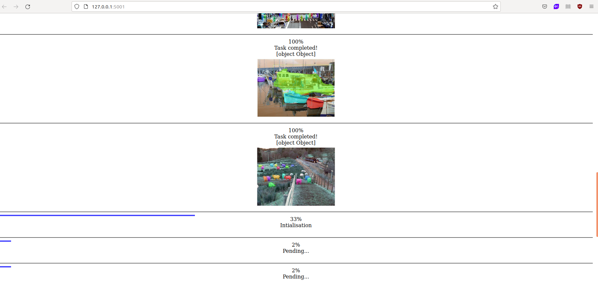

# Webapp inference computer vision maskrcnn model asynchronously using workers

# Abstract
This is a flask webapplication. The interface on the browser is used to send a bunch of images and display inferences of maskrcnn as a result.

The backend is built with python (flask, celery, tensorflow-keras, opencv) and redis for queuing tasks.

here the result: 

The maskrcnn coco is pre trained to recognize 81 classes :

['person', 'bicycle', 'car', 'motorcycle', 'airplane', 'bus', 
'train', 'truck', 'boat', 'traffic light', 'fire hydrant', 'stop sign', 
'parking meter', 'bench', 'bird', 'cat', 'dog', 'horse', 'sheep', 'cow', 
'elephant', 'bear', 'zebra', 'giraffe', 'backpack', 'umbrella', 'handbag', 
'tie', 'suitcase', 'frisbee', 'skis', 'snowboard', 'sports ball', 'kite', 
'baseball bat', 'baseball glove', 'skateboard', 'surfboard', 'tennis racket', 
'bottle', 'wine glass', 'cup', 'fork', 'knife', 'spoon', 'bowl', 'banana', 
'apple', 'sandwich', 'orange', 'broccoli', 'carrot', 'hot dog', 'pizza', 
'donut', 'cake', 'chair', 'couch', 'potted plant', 'bed', 'dining table', 
'toilet', 'tv', 'laptop', 'mouse', 'remote', 'keyboard', 'cell phone', 'microwave', 
'oven', 'toaster', 'sink', 'refrigerator', 'book', 'clock', 'vase', 'scissors', 
'teddy bear', 'hair drier', 'toothbrush']

# I. Install

git clone https://github.com/BenoitBarbereau/maskrcnn_inference_with_workers.git

From my google drive download weights and mrcnn model 
https://drive.google.com/drive/folders/1E9O_j9b4ph7DpEUBI7DfQUcGVwyaVIWP?usp=sharing

Copy/paste the mask_rcnn_coco.h5 files into ./app/utils/maskrcnn

Set up a virtual environment and install dependencies

python3 -m venv --system-site-packages ./env

source ./env/bin/activate

pip install --upgrade pip

pip install -r requirements.txt

# II. Webapp inference 

## STEP 1

Select folders containing images ( ./Images_test ) 

## STEP 2 

Install and launch REDIS on a terminal

 ./run-redis.sh

## STEP 3 

Run celery on an other terminal side by side with redis

env/bin/celery worker -A app.celery --loglevel=info --pool gevent --concurrency=1

## STEP 4

run flower to monitor worker queue on your favorite browser

source env/bin/activate

flower -A app.celery --port=5555

reach flower webapp on  http://localhost:5555/

## STEP 5

then run the application on an other terminal

source env/bin/activate

python run.py

## STEP 6

On your favorite web browser reach 127.0.0.1:5001

Select a folder containing images and maskrnn will be running with workers on the background making inference in a row without freezing the webapp

just be patient

